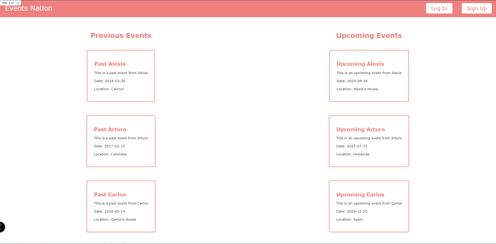

# Private-Events

This is a private events platform created with Ruby on Rails, where users can Create or Attend multiple events. Advanced Associations from ActiveRecord were used in this project.

# About

We created an Events Web-App based on the functionality of Eventbrite site. For this, we had to work with Active Record associations, model validations, advanced queries, and session cookies for user authentication.

What you can do on the app:
- Create users and login with your user
- View all events: past and upcoming
- Access to the information of each event: description, date, location and attendees
- Register for an event while you are logged in
- Create events as a registered user

In this project we:
- Created models, views, and controllers for users and events
- Made validations for the user inputs
- Created a controller and a model for the attendance of each event
- Worked with associations between users, events, and attendances

# Application Screenshot

# Built With:
- Ruby on Rails
- SQLite
- Rubocop

# Prerequesites:
- Ruby
- Rails
- Yarn

# Setup:
- Clone this repository.
- Open the project folder where the repository was downloaded.
- In your terminal, run the command `bundle install`. This will install all the required dependencies.
- Thereafter, run the migrations. To do this, while in the project root folder, run the command: `rails db:migrate`.
- Run the command `yarn install --check-files` to install all the yarn dependencies of the project.

### Usage
1. Start the server with `rails s`, and visit **localhost:3000** to use the app.
2. On the navbar on the top you will see all the actions you can execute.
3. If you want to sign up for an upcoming event do the following:
    - create a new user
    - create a new event while logged in
      - make sure the date of the event is set to an upcoming date
    - log out
    - create another new user
    - while logged in, go to the the homepage
    - look for the upcoming events list on your right
    - click on the event you created with the last user
    - click on the `register` button
    - you are now an attendee for the event!

### Run tests
To run the Rspec tests do the following:
- run `rspec --init` unless you already have ***Rspec*** installed in your local envoriment
- Open your terminal and go to the project's root directory
- Type this `rspec --format doc` to see test example results
# Authors

👤 **Alexisbec**
- Github: [@alexisbec](https://github.com/alexisbec)
- Linkedin: [Alexis Varela](www.linkedin.com/in/alexbec)
- Twitter : [@AlexisV31667779](https://twitter.com/AlexisV31667779)

👤 **Arturo Alvarez**
- Github: [@StarSheriff2](https://github.com/StarSheriff2)
- Twitter: [@ArturoAlvarezV](https://twitter.com/ArturoAlvarezV)
- Linkedin: [Arturo Alvarez](https://www.linkedin.com/in/arturoalvarezv/)

# 🤝 Contributing

Contributions, issues and feature requests are welcome!

Feel free to check the issues page.

# Show your support
Give a ⭐️ if you like this project!

# 📝 License
This project is [MIT](https://github.com/StarSheriff2/private-events/blob/feature-branch-app/LICENSE) licensed.
